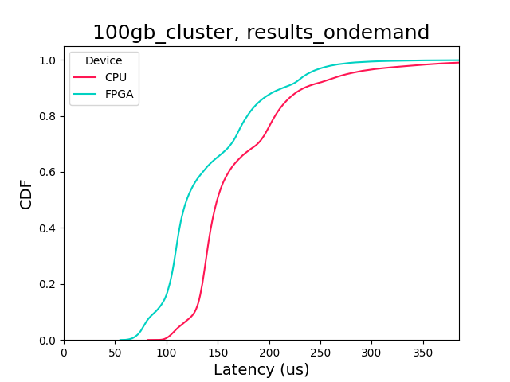
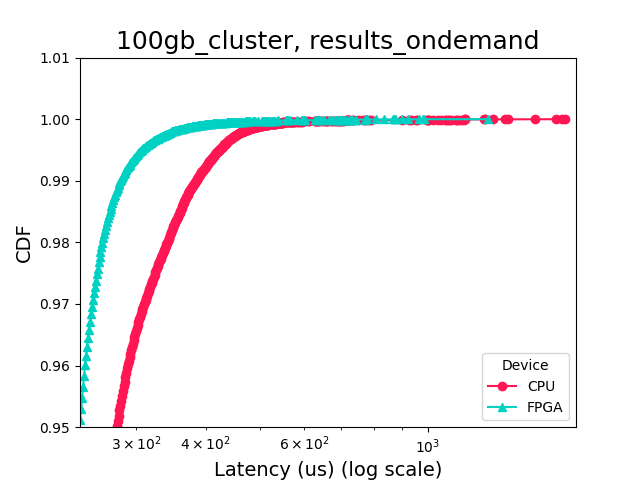

Command: `analysis_katie_cdf.py 100gb_cluster results_ondemand fpga_cluster results_ondemand`

Output file name: results_ondemand,config,4,2,2,raw data vs value vs source,Stats:

Median latency CPU: 150

95% latency CPU: 277

99% latency CPU: 385

Max latency CPU: 1759

Median latency FPGA: 120

95% latency FPGA: 238

99% latency FPGA: 282

Max latency FPGA: 1280

